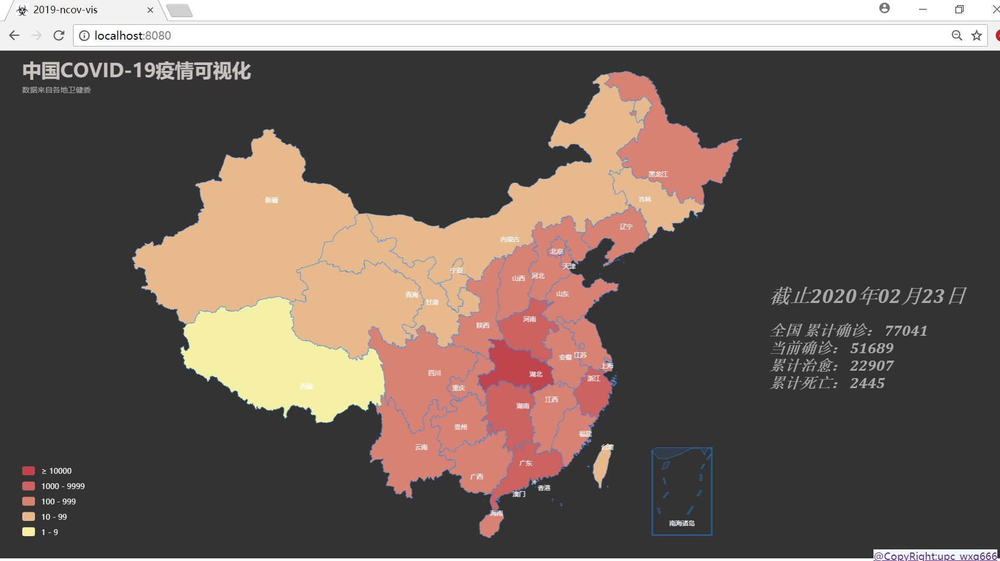
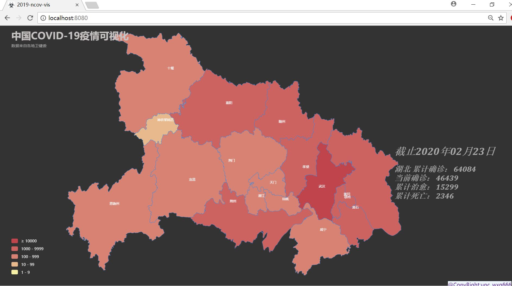

# 2019-ncov-vis

## Project setup
```
npm install
```

### Compiles and hot-reloads for development
```
npm run serve
```

### Compiles and minifies for production
```
npm run build
```

### Lints and fixes files
```
npm run lint
```

### Customize configuration
See [Configuration Reference](https://cli.vuejs.org/config/).

## Project summary

### 关于数据

[数据调用天行肺炎疫情API](https://www.tianapi.com/apiview/170 "数据接口")

### 使用说明
#### 缩放层级-国家


#### 缩放层级-省级
左键点击实现下钻到省级，右键单击回退

